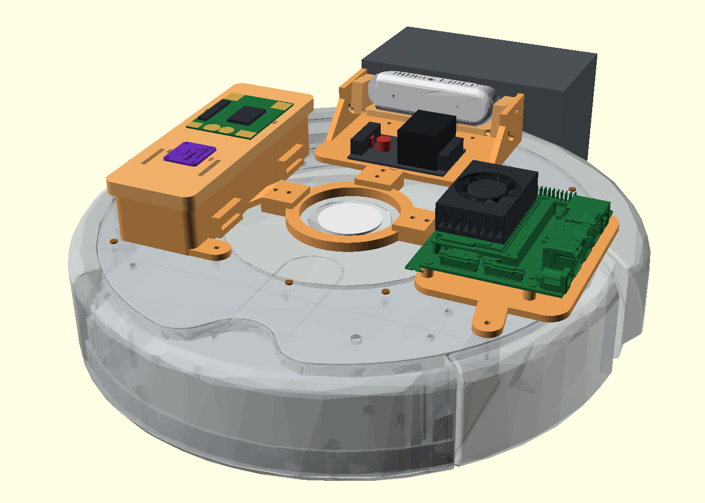

# Roomba 690 controller

Low-latency WASD control for an iRobot Roomba 690 over its Mini-DIN serial
port, using the Open Interface (OI) protocol. Drive it from a browser or a
terminal; a keypress reaches the wheels in about 1.5-2 ms.



## Why

I wanted to drive my Roomba by hand with no perceptible lag, as the base layer
before bolting a Jetson and a depth camera on top and letting it drive itself.
Two things were in the way. First, the 690 is the Wi-Fi model, and it was not
obvious it even still exposed the wired Open Interface -- community reports on
the 600-series Wi-Fi units are contradictory. It does (see
[`docs/RESEARCH.md`](docs/RESEARCH.md)). Second, most OI examples poll the robot
for sensor data on the same thread that sends drive commands, and that sensor
query blocks for ~16 ms per call, which you feel as lag on every keypress. This
project is built around not doing that.

## How it works

`server.py` runs a plain HTTP server for the UI (port 8666) and a WebSocket for
control and telemetry (port 8667). The design decision that matters is on the
timing:

- **Keypresses are applied the instant they arrive**, not on the next tick of a
  loop. A 50 Hz control loop exists, but it only runs the watchdog, a keepalive
  refresh and the telemetry push. Deferring input to a tick would add up to
  20 ms of avoidable lag.
- **Telemetry is streamed, not polled.** OI opcode 148 makes the robot push a
  chosen set of sensor packets at ~64 Hz on its own. A background thread drains
  and checksums them; the control path only ever writes. A blocking sensor
  *query* (opcode 142) measures 15.67 ms per call, so keeping it off the control
  path is what removes the jitter. The two never block each other.

`roomba_oi/` is the protocol layer: opcodes and the sensor packet table
(`protocol.py`), the serial driver with the reader thread and stream parser
(`driver.py`), and a WASD-to-wheel-velocity mixer (`mixer.py`). The reverse
engineering of this specific unit -- measured latencies, a firmware off-by-one
in the mode byte, the fact that this cable can't wake a sleeping robot -- is
written up in `docs/RESEARCH.md`.

## Run it

```bash
python3 -m venv .venv && ./.venv/bin/pip install -r requirements.txt
./run.sh
```

`run.sh` finds the first `/dev/cu.usbserial-*` (override with `ROOMBA_PORT=`).
Then open <http://127.0.0.1:8666/>.

**If nothing appears: press the CLEAN button on the Roomba.** It sleeps after
5 minutes in Passive mode, and this cable can't wake it in software (RESEARCH.md
§5.3). The server tells you and waits.

Terminal fallback, no browser: `./.venv/bin/python drive_tui.py`.
Connection diagnostic (read-only, never sends a motion command):
`./.venv/bin/python probe.py`.

Only `pyserial` and `websockets` are needed to drive the robot; the rest of
`requirements.txt` is for the hardware model pipeline below.

## Controls

| Key | Action |
|---|---|
| `W` / `S` | forward / reverse |
| `A` / `D` | arc while moving; spin in place when stopped |
| `-` / `=` | trim drive speed by 20 mm/s |
| `Space` | emergency stop (toggle) |
| `Shift` | boost (1.7x drive, 1.4x turn) |

Click the page once so it has keyboard focus.

## No autonomous cleaning

The robot is held in **Safe mode** for the whole session. In Safe mode it waits
with all motors off and ignores its own buttons and sensors, so it cannot start
a cleaning cycle on its own. Two things make that stick, both automatic:

- **If the robot falls out of Safe** (a cliff, a wheel drop), the server puts it
  straight back. Without this it sits in Passive, where a *paused* cleaning cycle
  is still alive and resumes the moment it leaves the dock -- which is exactly
  why an undocked Roomba suddenly starts cleaning.
- **On exit the robot is powered off** (`--park off`, the default). Passive alone
  would let that paused cycle restart later. It still charges while powered off.

`Seek dock` deliberately hands control back so the robot can drive itself home,
and stops holding Safe. Press `Safe mode`, or any drive key, to take control
back. Use `--park passive` to leave it awake in Passive on exit instead.

## Safety

- **Safe mode by default**: cliff, wheel-drop and charger cut-outs stay active.
  A trip drops the robot to Passive; the UI banners it and re-arms Safe.
- **Full mode** disables those cut-outs -- the robot will drive off a stair edge.
  It is behind a confirmation dialog.
- **350 ms watchdog**: no client traffic and the wheels halt. Covers a closed
  tab, a crashed browser, Wi-Fi dropping, or the process being killed (SIGTERM
  and SIGHUP are handled so cleanup still runs).
- Releasing keys, losing window focus, or disconnecting all halt the wheels.
- On exit the robot is parked back in Passive -- Safe/Full never sleep and stop
  charging, which deep-discharges the battery on the dock.

## Heading

The heading readout is dead-reckoned from the wheel encoders
(`mm = counts x pi x 72 / 508.8`, `dheading = (right - left) / 235 mm`). It
reads 0 until the wheels turn, and **Zero heading** resets it. It drifts: the
encoders are square-wave, not quadrature, so they count using the robot's
*commanded* direction. Pushing the robot by hand or wheel slip corrupts the
estimate -- zero it to recover. If a measured 360-degree spin doesn't return to
0, trim `WHEELBASE_MM` in `roomba_oi/protocol.py`.

## Hardware model

The other half of the repo is a parametric mount that carries a Jetson Xavier NX
and an Intel RealSense on top of the robot. `hardware/dimensions.json` is the
single source of truth for every physical dimension; both the OpenSCAD model and
the Three.js viewer read it, so they can't disagree.

- `gen.py` writes `dims.scad`, which `roomba_nx.scad` includes. Export a part
  with `openscad -D 'part="hub"' -o stl/hub.stl roomba_nx.scad` (parts: hub,
  jetson_plate, front_plate, camera_rocker, battery_cradle, battery_lid,
  dock_pin_block, pad_carrier); `part="assembly"` renders the whole robot.
- `verify.py` re-assembles the exported STLs and checks the build against its own
  rules -- height and radius against the shell, part-to-part interference by
  voxel overlap, the camera's tilt sweep, and the four things that must stay
  reachable (Clean button, dust bin, front IR boss, mini-DIN). It exits non-zero
  on a failure; run it after every geometry change.
- `build_viewer.py` injects the JSON and the STLs into a template and writes
  `docs/assembly-3d.html`, an interactive Three.js view. Renders of the current
  design are in `hardware/preview/`.

Change a number in the JSON, rerun `gen.py`, re-export the affected STLs, run
`verify.py`, then rerun `build_viewer.py`.

## Status

Works end to end on my hardware: a Roomba 690 on `/dev/cu.usbserial-BG03LB59`
(FTDI FT232R), macOS. The driving/telemetry loop is complete and the latency and
firmware findings in RESEARCH.md are all measured on this unit, not copied from
the spec. The hardware model generates, verifies and renders, but the physical
mount has not been printed or fitted yet -- some dimensions still depend on
measurements listed in `scans/README.md`, and one vendor chassis mesh is off by
~12 mm, so treat the fit as unverified until then.

Generated STLs, third-party vendor CAD and datasheet PDFs are gitignored (they
are large and not mine to redistribute); re-fetch them from the sources in
`docs/RESEARCH.md` and `scans/README.md`, and regenerate the STLs with the
commands above.

## Layout

```
roomba_oi/protocol.py   opcodes, packet table, encoding, frame checksum
roomba_oi/driver.py     serial driver: reader thread, stream parser, mode calibration
roomba_oi/mixer.py      keys -> left/right wheel velocities
server.py               HTTP (8666) + WebSocket (8667) + control loop
web/index.html          browser controller UI
drive_tui.py            terminal fallback
probe.py                connection diagnostic
hardware/               parametric OpenSCAD mount + verifier + Three.js viewer
docs/RESEARCH.md        protocol notes and measurements
```

## License

MIT, see [LICENSE](LICENSE).
